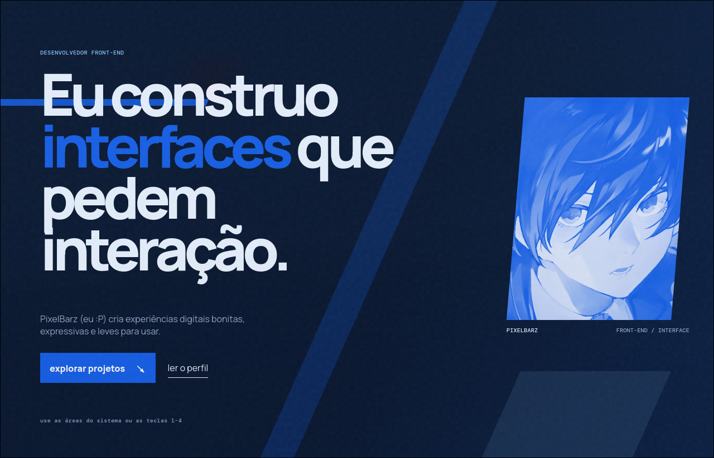

<div align="center">

```
██████╗  ██████╗ ██████╗ ████████╗███████╗ ██████╗ ██╗     ██╗ ██████╗ 
██╔══██╗██╔═══██╗██╔══██╗╚══██╔══╝██╔════╝██╔═══██╗██║     ██║██╔═══██╗
██████╔╝██║   ██║██████╔╝   ██║   █████╗  ██║   ██║██║     ██║██║   ██║
██╔═══╝ ██║   ██║██╔══██╗   ██║   ██╔══╝  ██║   ██║██║     ██║██║   ██║
██║     ╚██████╔╝██║  ██║   ██║   ██║     ╚██████╔╝███████╗██║╚██████╔╝
╚═╝      ╚═════╝ ╚═╝  ╚═╝   ╚═╝   ╚═╝      ╚═════╝ ╚══════╝╚═╝ ╚═════╝ 
                                                                       
  josé braz · front-end developer
```

**Portfólio pessoal moderno, fluido e minimalista — sem frameworks, 100% vanilla.**

[](https://josebraz.cc)
[](.)
[](.)
[](.)
[](.)

</div>

---

## ✦ Preview

> **→ [josebraz.cc](https://josebraz.cc)**



---

## ✦ Sobre

Portfólio pessoal de **José Braz (pixelbarz)** — estudante e front-end developer em evolução. O site apresenta trabalho, serviços e formas de contato com uma UI inspirada em terminais e estética retro-tech.

Feito do zero com HTML, CSS e JavaScript puro. Sem dependências, sem frameworks, sem frescura.

---

## ✦ Seções

| Seção | O que tem |
|---|---|
| `#inicio` | Hero com headline rotativa, foto, stats com contador animado |
| `#sobre` | Apresentação e valores: comunicação, performance, estética |
| `#servicos` | Landing page, portfólio profissional, refatoração visual |
| `resultado` | Comparativo visual antes/depois |
| `#projetos` | Cards de projetos com imagens e links |
| `#contato` | Cards rápidos para LinkedIn, GitHub e link page |

---

## ✦ Features

- 🖥️ **Boot screen** — tela de terminal animada no carregamento
- 🌗 **Tema claro/escuro** — toggle com persistência em `localStorage`
- 📜 **Scroll progress bar** — barra de progresso no topo
- ✨ **Reveal on scroll** — elementos entram com fade-in ao rolar
- 🔢 **Contadores animados** — números incrementam ao entrar na tela
- 🔄 **Headline rotativa** — texto do hero muda automaticamente
- 📱 **Totalmente responsivo** — menu hambúrguer para mobile
- 🎨 **Fundo animado** — ambient shapes e grid em movimento
- ⚡ **Zero dependências** — HTML + CSS + JS vanilla puro

---

## ✦ Stack

| Tecnologia | Uso |
|---|---|
| `HTML5` | Estrutura semântica, OG tags, acessibilidade |
| `CSS3` | Variáveis, animações, grid, temas claro/escuro |
| `JavaScript` | Boot screen, tema, contadores, reveal, menu |
| `JetBrains Mono` | Fonte mono dos elementos de terminal |
| `Space Grotesk` | Fonte principal do conteúdo |
| `GitHub Pages` | Deploy via domínio customizado `josebraz.cc` |

---

## ✦ Estrutura

```
portifolio/
├── index.html        # Toda a estrutura da página
├── styles.css        # Estilos principais (temas, layout, animações)
├── style.css         # Estilos complementares
├── script.js         # Interatividade (boot, tema, counters, scroll)
├── barzpfpwoah.png   # Foto de perfil
├── fachada.png       # Screenshot do projeto Casa Trigo Zero
├── links.png         # Screenshot da link page
├── preview.png       # Preview do portfólio (usado no og:image)
├── favicon.ico       # Ícone da aba
└── CNAME             # Domínio customizado josebraz.cc
```

---

## ✦ Rodando localmente

```bash
# Clone o repositório
git clone https://github.com/pixelbarz/portifolio.git

# Entre na pasta
cd portifolio

# Suba um servidor local (Python)
python3 -m http.server 3000

# Acesse no browser
# → http://localhost:3000
```

> Também funciona só abrindo o `index.html` direto, mas o servidor local evita problemas com fontes e assets.

---

## ✦ Projetos em destaque

- **[Casa Trigo Zero](https://pixelbarz.github.io/casatrigozero/)** — Landing page para cliente real
- **[Links do Barz](https://pixelbarz.github.io/linksdobarz/)** — Link page pessoal com terminal interativo

---

## ✦ Contato

- 🌐 [josebraz.cc](https://josebraz.cc)
- 💼 [LinkedIn](https://www.linkedin.com/in/jos%C3%A9-braz-9842023a8/)
- 🐙 [GitHub](https://github.com/pixelbarz)
- 🟣 [Twitch](https://www.twitch.tv/pixelbarz)

---

<div align="center">

feito com 💜 por **[@pixelbarz](https://github.com/pixelbarz)** · Brasil · 2026

</div>
